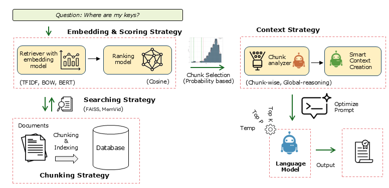

Algorithm
##############

The ``LLMlight`` method consists of several key components: **Preprocessing & Chunking**, **Embedding & Local Storage**, and **Retrieval-Augmented Generation with Statistical Validation**. Each component contributes to efficient, accurate, and reproducible handling of user queries over large document collections.

The figure below illustrates the end-to-end workflow of LLMlight:

   Schematic overview of the LLMlight workflow.

**Workflow Steps**

1. **Input Data or Documents**: Raw documents (PDFs, text files, etc.) are preprocessed to remove noise such as headers, footers, and boilerplate text.

2. **Chunking**: Documents are split into meaningful chunks to ensure each contains enough context for embedding and retrieval.

3. **Embedding & Local Storage**: Each chunk is transformed into vector embeddings and stored in a local SQLite database with an optional HNSW index for fast approximate nearest-neighbour search. When ``hnswlib`` and ``sentence-transformers`` are not available, LLMlight falls back to TF-IDF search automatically.

4. **Query Processing & Retrieval**: User queries are transformed into embeddings and compared against the stored chunks using similarity measures.

5. **Statistical Validation**: LLMlight constructs a null distribution to assess the statistical significance of retrieved chunks, separating true signal from noise.

6. **Context Aggregation & LLM Inference**: Selected chunks are aggregated and provided as context to the local language model for generation of accurate and grounded responses.

7. **Output & Visualization**: Results can be saved, reused, or visualized using the built-in plotting tools.

.. note::

   This schematic provides a clear picture of how LLMlight integrates preprocessing, embeddings, local storage, statistical validation, and language model inference into a robust retrieval-augmented generation system.

Get Available LLM Models
############################

LLMlight allows users to query which language models are available locally or for download. This is useful when you want to quickly switch models, validate compatibility, or explore alternative options for your use case.

This method returns a list of model names that can be used in the :class:`LLMlight.LLMlight` initializer for creating local language models.
Retrieving available models can be done via the :func:`LLMlight.LLMlight.LLMlight.get_available_models` method.

.. code:: python

    from LLMlight import LLMlight

    # Initialize LLMlight client
    client = LLMlight(verbose='info')

    # Get a list of available models
    modelnames = client.get_available_models(validate=False)

    # Print available models
    print("Available models:", modelnames)

- **validate=False**: Skips checking the integrity or availability of models, making retrieval faster.
- **verbose='info'**: Shows additional information during model retrieval, such as download progress or caching messages.

Preprocessing & Chunking
############################

The first step is **Preprocessing & Chunking**. Input documents are split into manageable chunks to allow efficient embedding and retrieval. Headers, footers, and boilerplate text are removed to reduce noise. Chunks are sized appropriately (typically >200 characters) to avoid hallucinations.

.. code:: python

    from LLMlight import LLMlight
    
    # Initialize with default settings and only use the top 5 chunks in the analysis
    client = LLMlight(model='liquid/lfm2-24b-a2b', top_chunks=5, chunks={'method': 'words', 'size': 1000, 'overlap': 200})
    
    # Create local database
    client.memory_init(store_path='local_database.db', overwrite=True)
    
    # Add multiple PDF files to the database
    url = 'https://proceedings.neurips.cc/paper_files/paper/2017/file/3f5ee243547dee91fbd053c1c4a845aa-Paper.pdf'
    pdf_text1 = client.read_pdf(url)
    client.memory_add(text=pdf_text1)
    # Ad another pdf
    url = 'https://proceedings.neurips.cc/paper_files/paper/2017/file/3f5ee243547dee91fbd053c1c4a845aa-Paper.pdf'
    pdf_text2 = client.read_pdf(url)
    client.memory_add(text=pdf_text2)
    
    # Or alternatively
    # client.memory_add(files=[pdf_text1, pdf_text2])
    
    # Get all chunks
    out = client.memory.get_all_chunks()
    print(f'Number of chunks stored: {len(out)}')
    
    # Make prompt
    client.prompt('Explain the working of HNet - hypergeometric networks in 4 sentences.')

Embedding & Local Storage
############################

In **Embedding & Local Storage**, each chunk is transformed into a vector representation. These embeddings are stored in a local SQLite database (default backend) with an optional HNSW index, making retrieval fast, offline-friendly, and portable. Users can also add small text chunks or entire directories.

.. code:: python

    
    summary_text = client.summarize(context=pdf_text)
        
        # Add additional text chunks
        client.memory_add(text=[
            'Apes like USB sticks.',
            'The capital of France is Amsterdam.'
        ])
    
        # Add all supported file types from a directory
        client.memory_add(
            dirpath='c:/my_documents/',
            filetypes=['.pdf', '.txt', '.epub', '.md', '.doc', '.docx', '.rtf', '.html', '.htm']
        )
    
        # Store the database to disk (SQLite is auto-persisted; this also saves the ANN index)
        client.memory_save()
        
        client.prompt('What is the capital of france?', instructions='Your response must be the truth.')
        # 'The provided context states that "The capital of France is Amsterdam." However, this information is incorrect based on general knowledge. The actual capital of France is Paris. The context given here contains an error or is intentionally misleading. \n\n### Summary 1: \nThe correct capital of France is Paris, not Amsterdam as stated in the context.'
        
        client.prompt('What is the capital of france?', instructions='only use the context.', response_format='only output 1 word.')
        # Amsterdam

RAG with Statistical Validation
########################################################

During **Retrieval-Augmented Generation (RAG)**, queries are compared against stored chunks using similarity measures. LLMlight constructs a null distribution of scores to evaluate statistical significance. Only chunks that are likely relevant are selected and aggregated for the language model to generate grounded responses.

.. code:: python

    # Load database for inference.
    client = LLMlight(model='liquid/lfm2-24b-a2b', alpha=0.1)
    client.memory_init(store_path='local_database1.db')
    
    # Inspect top 2 chunks
    client.memory_chunks(n=2)
    
    # Search through chunks using queries
    out1a = client.relevant_memory_retrieval('Attention Is All You Need')
    out2a = client.relevant_memory_retrieval('Enrichment analysis, Hypergeometric Networks')
    
    # RAG only
    out1b = client.memory.search('Attention Is All You Need')
    out2b = client.memory.search('Enrichment analysis, Hypergeometric Networks', top_k=3)

.. note::

    This approach separates true signal from coincidental patterns, making retrieval robust and ensuring that responses are based on meaningful content rather than surface-level similarity.

.. include:: add_bottom.add
